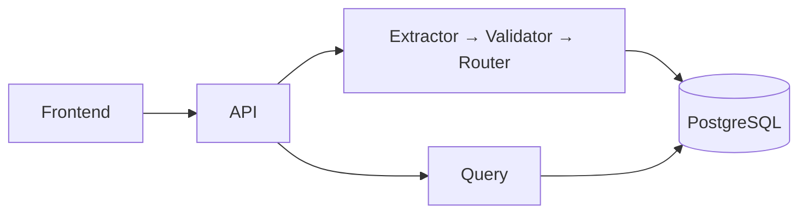

# Nova

Operational multi-agent AI for **trade/shipping document verification**.

## Problem

Manual shipper ↔ control-group email loops are slow and error-prone. Blind automation is unsafe when documents are incomplete, ambiguous, or adversarial.

## Solution

A fail-closed Part 1 pipeline that extracts fields with evidence, validates customer rules, and routes each case to **AUTO_APPROVE**, **HUMAN_REVIEW**, or **AMENDMENT_REQUEST** — never inventing missing values and never silently approving uncertainty.

## Core workflow

```text
Upload → process → Extractor → Validator → Router → PostgreSQL → Query / UI
```

## Architecture



Detailed diagram: [docs/submission/architecture-diagram.md](./docs/submission/architecture-diagram.md).

## Three agents

| Agent | Responsibility |
|-------|----------------|
| Extractor | Assignment fields + confidence + presence + evidence |
| Validator | MATCH / MISMATCH / UNCERTAIN with expected vs found |
| Router | Exactly one disposition under hard safety constraints |

## Technology stack

Python 3.12 · FastAPI · Pydantic · SQLAlchemy/Alembic · PostgreSQL 16 · React/Vite · Docker Compose · `LLMPort` (MockLLM default; optional OpenAI-compatible vision/text)

## POC capabilities

- PDF, plain text, PNG, JPEG ingest
- Eight GoComet assignment fields on invoice/BoL extractions
- Real document preview in UI from stored blobs
- Grounded NL query (including “flagged this week”)
- Offline evals with false AUTO_APPROVE = 0 and fabrication = 0

## Security / trust

API key auth · MIME sniffing · path/size limits · no arbitrary SQL · anti-fabrication extraction · fail-closed routing · secrets via `.env` only

## Evaluation

```bash
PYTHONPATH=src python scripts/run_full_evaluation.py
```

## UI

Minimal ops UI: dashboard, upload, document (preview + fields + validation + decision), shipment, query. Data from live API — no hardcoded business results.

## Run locally

```bash
cp .env.example .env   # set API_AUTH_TOKEN + DB password
python -m venv .venv && source .venv/bin/activate
pip install -e ".[dev]"
# requires local Postgres + alembic upgrade head for non-Docker API
```

## Run with Docker

```bash
docker compose up --build
# API http://localhost:8000  UI http://localhost:8080
```

Optional live LLM: set `LLM_PROVIDER=openai`, `LLM_API_KEY`, and a vision-capable `LLM_MODEL` (e.g. `gpt-4o-mini`). Without credentials, MockLLM keeps CI/demo deterministic.

## Demo

[docs/operations/demo-runbook.md](./docs/operations/demo-runbook.md)

## Assignment deliverables

| Deliverable | Location |
|-------------|----------|
| PRD | [docs/submission/prd.md](./docs/submission/prd.md) |
| Technical write-up | [docs/submission/technical-writeup.md](./docs/submission/technical-writeup.md) |
| Architecture diagram | [docs/submission/architecture-diagram.md](./docs/submission/architecture-diagram.md) |

## Known limitations

- Live vision quality depends on provider credentials (absent → MISSING fields, not invented values)
- Scanned-PDF OCR not a separate adapter (image/vision path covers PNG/JPEG; digital PDF text only)
- Remote production deploy evidence not executed
- See [docs/audits/known-limitations.md](./docs/audits/known-limitations.md)

## Part 2 roadmap

Email/file triggers, multi-doc + cross-doc validation, human approval actions, draft replies, outbound send — **PLANNED, NOT IMPLEMENTED**. Extension points: [docs/architecture/part2-extension-points.md](./docs/architecture/part2-extension-points.md).

## License

License not yet chosen.
