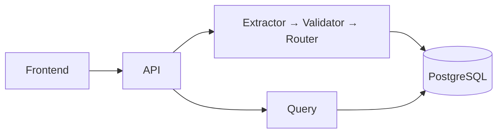

# Nova

Operational multi-agent AI for **trade/shipping document verification**.

## Problem

Manual shipper ↔ control-group loops are slow and error-prone. Blind automation is unsafe when documents are incomplete, ambiguous, or adversarial.

## Solution

Fail-closed Part 1 pipeline: extract fields with evidence → validate customer rules → route to **AUTO_APPROVE** / **HUMAN_REVIEW** / **AMENDMENT_REQUEST**. Never invent missing values; never silently approve uncertainty.

## Core workflow

```text
Upload → process → Extractor → Validator → Router → PostgreSQL → Query / UI
```

## Architecture



Detailed diagram: [docs/submission/architecture-diagram.md](./docs/submission/architecture-diagram.md) · [ARCHITECTURE.md](./ARCHITECTURE.md)

## Three agents

| Agent | Responsibility |
|-------|----------------|
| Extractor | Assignment fields + confidence + presence + evidence |
| Validator | MATCH / MISMATCH / UNCERTAIN (expected vs found) |
| Router | One disposition under hard safety constraints |

## Technology stack

Python 3.12 · FastAPI · Pydantic · SQLAlchemy/Alembic · PostgreSQL 16 · React/Vite · Docker Compose · `LLMPort` (MockLLM default; optional OpenAI-compatible vision/text)

## Run with Docker

```bash
cp .env.example .env   # set API_AUTH_TOKEN + POSTGRES_PASSWORD
docker compose up --build
# API http://localhost:8000  UI http://localhost:8080
curl http://localhost:8000/health && curl http://localhost:8000/ready
```

Optional live LLM: `LLM_PROVIDER=openai`, `LLM_API_KEY`, vision-capable `LLM_MODEL` (e.g. `gpt-4o-mini`). Without credentials, MockLLM keeps CI/demo deterministic.

## Run tests

```bash
ruff check src tests && mypy src && pytest -q
cd frontend && npm ci && npm test && npm run typecheck && npm run build
```

## Run evaluation

```bash
PYTHONPATH=src python scripts/run_full_evaluation.py
```

## Demo / UI

[docs/operations/demo-runbook.md](./docs/operations/demo-runbook.md) — upload `fixtures/demo/synthetic_invoice_clean.txt`, open document page for preview + fields + validation + decision.

## Assignment deliverables

| Deliverable | Location |
|-------------|----------|
| PRD | [docs/submission/prd.md](./docs/submission/prd.md) |
| Technical write-up | [docs/submission/technical-writeup.md](./docs/submission/technical-writeup.md) |
| Architecture diagram | [docs/submission/architecture-diagram.md](./docs/submission/architecture-diagram.md) |
| Traceability / audit map | [docs/audits/final-gocomet-file-location-map.md](./docs/audits/final-gocomet-file-location-map.md) |
| Final compliance audit | [docs/audits/final-gocomet-submission-audit.md](./docs/audits/final-gocomet-submission-audit.md) |

## Known limitations

- Live vision cost/latency **not measured** without API keys (absent → MISSING fields, not invented)
- Scanned-PDF OCR adapter deferred (PNG/JPEG vision path covers image MUST)
- Customer rule authoring UI thin (defaults + request rules)
- Remote production deploy **NOT EXECUTED**
- Detail: [docs/audits/known-limitations.md](./docs/audits/known-limitations.md)

## Part 2 (intentionally not implemented)

Email/file triggers, multi-doc + cross-doc validation, human approval actions, draft replies, outbound send — [docs/architecture/part2-extension-points.md](./docs/architecture/part2-extension-points.md).

## License

License not yet chosen.
