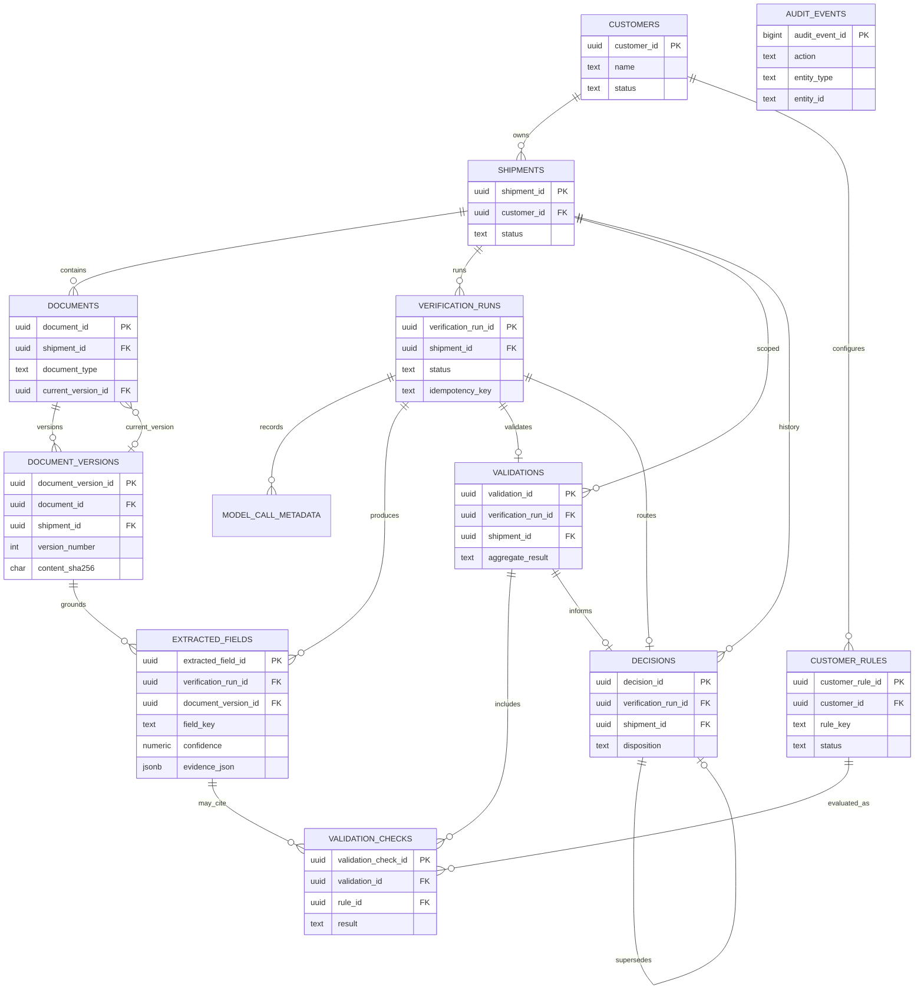

# Relationships and ER diagram

Cardinality and ownership for Nova’s domain. Complements [domain-model.md](./domain-model.md) and [schema-design.md](./schema-design.md).

---

## Primary pipeline chain

Part 1 often exercises a single document; the model remains **shipment-centric** and multi-document:

```text
Customer
  └── Shipment
        ├── Document (1..N)          ← Part 2: many attachments
        │     └── DocumentVersion (1..N)
        ├── VerificationRun (1..N)
        │     ├── ModelCallMetadata (0..N)
        │     ├── ExtractedField (0..N)  → pins DocumentVersion
        │     ├── Validation (0..1 primary)
        │     │     └── ValidationCheck (1..N) → CustomerRule
        │     └── Decision (0..1)
        └── Decision history (via runs)
```

Cross-document validation (Part 2) uses one `Validation` whose `document_version_ids` lists many versions and whose `ValidationCheck.compared_document_version_ids` may pair fields across documents.

---

## Cardinality matrix

| From | To | Cardinality | On delete (parent) | Notes |
|------|----|-------------|--------------------|-------|
| Customer | Shipment | 1:N | RESTRICT / soft-delete parent | Keep history |
| Customer | CustomerRule | 1:N | RESTRICT | Historical checks reference rules |
| Shipment | Document | 1:N | CASCADE soft or RESTRICT | Prefer soft-delete documents |
| Document | DocumentVersion | 1:N | RESTRICT | Versions immutable |
| Document | DocumentVersion (current) | N:1 | SET NULL then restrict | `current_version_id` |
| Shipment | VerificationRun | 1:N | RESTRICT | |
| VerificationRun | ExtractedField | 1:N | CASCADE only if run not succeeded; else RESTRICT | Prefer append-only |
| DocumentVersion | ExtractedField | 1:N | RESTRICT | |
| VerificationRun | Validation | 1:1 | RESTRICT | Primary pass |
| Validation | ValidationCheck | 1:N | CASCADE while drafting; freeze after complete | |
| CustomerRule | ValidationCheck | 1:N | RESTRICT | Never delete active history rules |
| ExtractedField | ValidationCheck | 1:0..N | SET NULL | Optional link |
| VerificationRun | Decision | 1:1 | RESTRICT | |
| Validation | Decision | 1:0..1 | SET NULL | |
| Decision | Decision (supersedes) | 1:0..1 | SET NULL | Chain across runs |
| * | AuditEvent | 1:N logical | **No cascade** | Soft refs |

---

## Foreign keys (summary)

```text
shipments.customer_id                    → customers.customer_id
documents.shipment_id                    → shipments.shipment_id
document_versions.document_id            → documents.document_id
document_versions.shipment_id            → shipments.shipment_id
documents.current_version_id             → document_versions.document_version_id
verification_runs.shipment_id            → shipments.shipment_id
model_call_metadata.verification_run_id  → verification_runs.verification_run_id
extracted_fields.verification_run_id     → verification_runs.verification_run_id
extracted_fields.document_version_id     → document_versions.document_version_id
extracted_fields.model_call_id           → model_call_metadata.model_call_id
customer_rules.customer_id               → customers.customer_id
validations.verification_run_id          → verification_runs.verification_run_id
validations.shipment_id                  → shipments.shipment_id
validation_checks.validation_id          → validations.validation_id
validation_checks.rule_id                → customer_rules.customer_rule_id
validation_checks.extracted_field_id     → extracted_fields.extracted_field_id
validation_checks.model_call_id          → model_call_metadata.model_call_id
decisions.verification_run_id            → verification_runs.verification_run_id
decisions.shipment_id                    → shipments.shipment_id
decisions.validation_id                  → validations.validation_id
decisions.model_call_id                  → model_call_metadata.model_call_id
decisions.supersedes_decision_id         → decisions.decision_id
```

---

## ER diagram (Mermaid)



`AUDIT_EVENTS` intentionally has no hard FK edges in the diagram.

---

## Multi-document / cross-document (Part 2 readiness)

```text
Shipment S
  Document Invoice  → Version v1
  Document BOL      → Version v2

VerificationRun R
  document_version_ids = [v1, v2]
  ExtractedField(invoice_number @ v1)
  ExtractedField(bol_ref @ v2)
  Validation V
    ValidationCheck: cross_document compare invoice_number ↔ bol_ref
      compared_document_version_ids = [v1, v2]
  Decision D
```

Part 1 may insert only the invoice (or only the BOL). No schema change is required to add the second document later.

---

## Ownership and aggregate roots

| Aggregate root | Contained |
|----------------|-----------|
| Customer | Rules (config bounded context; referenced, not cascaded from shipments) |
| Shipment | Documents, versions, runs, validations, decisions |
| VerificationRun | Extraction fields, model calls, validation, decision for that attempt |

Write APIs (future) should load/modify one aggregate at a time with the transaction boundaries in [schema-design.md](./schema-design.md).

---

## Anti-patterns avoided

| Anti-pattern | Why avoided |
|--------------|-------------|
| Shipment row holds single `file_blob` | Blocks multi-doc |
| Overwrite extraction in place | Breaks audit/replay |
| Replace router decision in place for human approval | Breaks Part 2 history |
| FK from audit → business with ON DELETE CASCADE | Destroys audit trail |
| One `validation` table that only accepts a single document id column | Blocks cross-doc |
