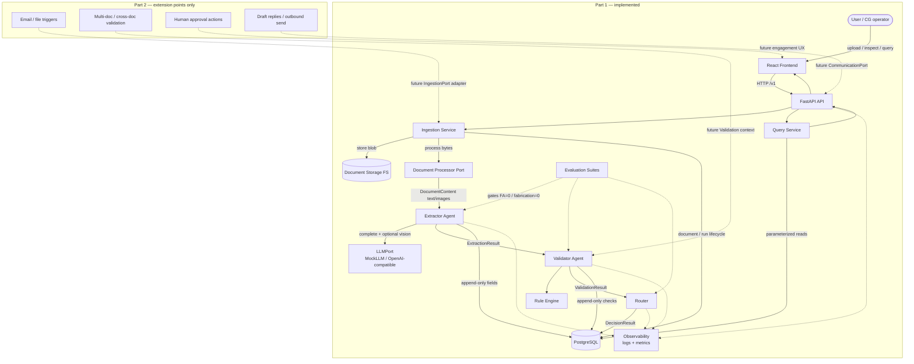

# Nova architecture diagram (GoComet submission)

Source-controlled Mermaid diagram for Part 1 with Part 2 extension points marked.

## Arrow legend

| Style | Meaning |
|-------|---------|
| Solid | Part 1 document flow, agent handoffs, persistence, query |
| Dotted to Obs | Correlation IDs / metrics (non-blocking) |
| Dotted Part 2 | Planned extension points — **not implemented** |

## Notes

- Domain logic does not import vendor SDKs; adapters implement `DocumentProcessorPort` and `LLMPort`.
- Router policy is authoritative for disposition; LLM advice cannot force `AUTO_APPROVE`.
- Full narrative: [technical-writeup.md](./technical-writeup.md), root [ARCHITECTURE.md](../../ARCHITECTURE.md).
