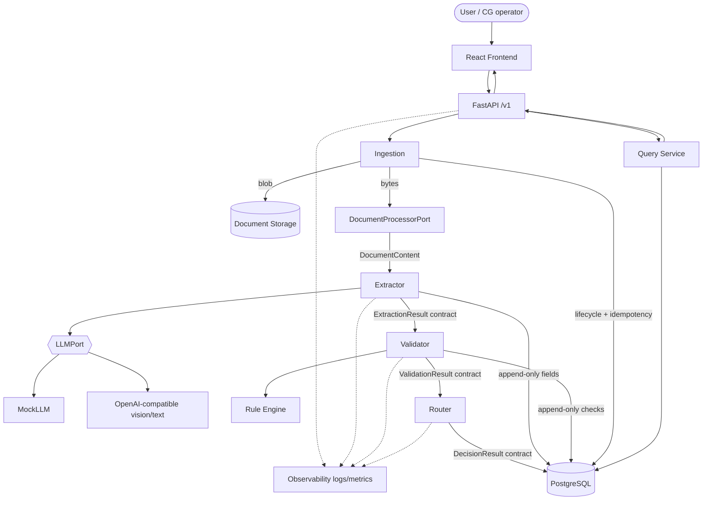

# Nova architecture diagram (GoComet submission)

Authoritative Part 1 diagram (Mermaid). Part 2 nodes are extension points only.

## Boundaries (not drawn as spaghetti)

| Boundary | Behavior |
|----------|----------|
| Processor | PDF / text / PNG / JPEG only; MIME sniff |
| LLM | Domain never imports vendor SDK; adapters only |
| Retry | Extractor bounded retries + timeout; fail closed |
| Router | Hard block on unsafe `AUTO_APPROVE` |
| Query | Allow-listed intents; reject SQL/prompt injection |

## Part 2 extension points (not implemented)

Email/file triggers → Ingestion · Multi-doc validation → Validator · Approval actions → UI · Outbound send → CommunicationPort

Full narrative: [technical-writeup.md](./technical-writeup.md) · Root overview: [ARCHITECTURE.md](../../ARCHITECTURE.md)
